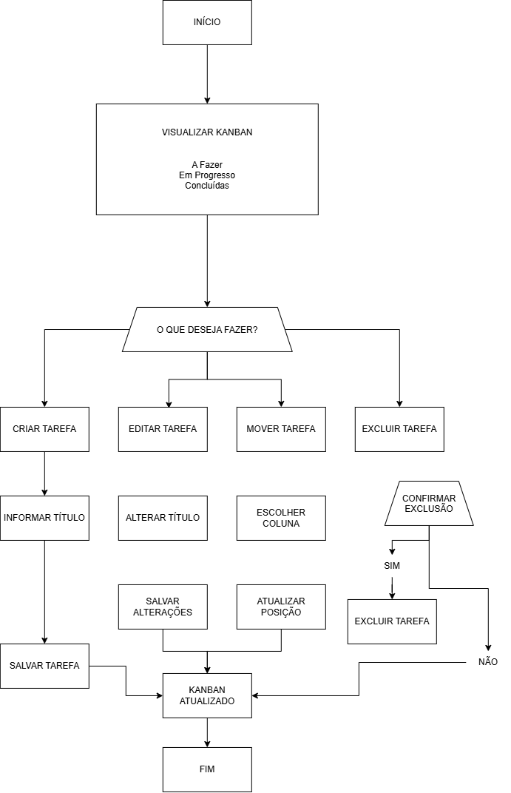

# Mini Kanban de Tarefas

Aplicação web de gerenciamento de tarefas desenvolvida como parte de um desafio técnico para o processo seletivo da **Veritas**.

O projeto consiste em um sistema Kanban que permite organizar tarefas em três etapas: **A Fazer**, **Em Progresso** e **Concluídas**.

A aplicação possui um frontend desenvolvido em React e um backend desenvolvido em Go, com comunicação realizada através de uma API REST.

## Funcionalidades

* Visualização de tarefas em formato Kanban
* Criação de tarefas
* Edição de tarefas
* Exclusão de tarefas
* Movimentação de tarefas entre os diferentes status
* Validações básicas dos dados
* Comunicação entre frontend e backend através de API REST
* Organização do backend por responsabilidades
* Configuração de CORS

## Tecnologias

### Frontend

* React
* JavaScript
* Vite
* Tailwind CSS
* React DOM

### Backend

* Go
* API REST
* CORS
* Armazenamento em memória

## Como executar

### Pré-requisitos

Antes de executar o projeto, certifique-se de ter instalado:

* [Node.js](https://nodejs.org/)
* npm
* [Go](https://go.dev/)

### 1. Clone o repositório

```bash
git clone https://github.com/Kickz1nn/desafio-fullstack-veritas.git
cd desafio-fullstack-veritas
```

### 2. Execute o backend

Entre na pasta do backend:

```bash
cd backend
```

Execute o servidor:

```bash
go run .
```

O backend será iniciado em:

```text
http://localhost:8080
```

### 3. Execute o frontend

Abra outro terminal e entre na pasta do frontend:

```bash
cd frontend
```

Instale as dependências:

```bash
npm install
```

Execute a aplicação:

```bash
npm run dev
```

O Vite disponibilizará a aplicação no endereço exibido no terminal, normalmente:

```text
http://localhost:5173
```

Com o backend e o frontend em execução, a aplicação estará pronta para uso.

## API

O backend disponibiliza uma API REST para gerenciamento das tarefas.

### Endpoints

| Método   | Endpoint     | Descrição              |
| -------- | ------------ | ---------------------- |
| `GET`    | `/tasks`     | Lista todas as tarefas |
| `POST`   | `/tasks`     | Cria uma nova tarefa   |
| `PUT`    | `/tasks/:id` | Atualiza uma tarefa    |
| `DELETE` | `/tasks/:id` | Exclui uma tarefa      |

### Modelo de tarefa

Uma tarefa possui a seguinte estrutura:

```json
{
  "id": 1,
  "title": "Estudar React",
  "status": "todo"
}
```

### Status disponíveis

| Valor         | Descrição    |
| ------------- | ------------ |
| `todo`        | A Fazer      |
| `in_progress` | Em Progresso |
| `done`        | Concluídas   |

### Exemplo de criação

Para criar uma nova tarefa, envie uma requisição `POST` para `/tasks` com um corpo semelhante a:

```json
{
  "title": "Estudar React",
  "status": "todo"
}
```

## Decisões técnicas

### Frontend

O frontend foi desenvolvido utilizando React, com a interface dividida em componentes e o gerenciamento do estado das tarefas realizado através dos recursos nativos do React.

A comunicação com a API foi centralizada no serviço responsável pelas requisições HTTP, mantendo essa responsabilidade separada da lógica de apresentação dos componentes.

### Backend

O backend foi desenvolvido em Go seguindo uma arquitetura baseada em API REST.

As responsabilidades foram separadas entre diferentes camadas, incluindo:

* Handlers
* Rotas
* Modelos
* Armazenamento
* Validações
* Middleware

Essa organização facilita a manutenção e permite que cada parte da aplicação tenha uma responsabilidade bem definida.

### Armazenamento

Foi utilizado **armazenamento em memória**, conforme permitido pelo escopo do desafio.

Essa abordagem mantém a implementação simples e adequada ao objetivo do projeto, sem a necessidade de configurar um banco de dados externo.

Como os dados são armazenados apenas durante a execução do servidor, as tarefas são perdidas quando o backend é encerrado ou reiniciado.

### Estilização

A interface utiliza **Tailwind CSS**, permitindo a criação dos componentes de forma rápida, consistente e responsiva.

## User Flow

O fluxo de utilização da aplicação foi documentado através de um diagrama que apresenta as principais interações do usuário com o sistema.



O fluxo contempla as principais operações disponíveis, incluindo:

* Visualização das tarefas
* Criação de tarefas
* Edição de tarefas
* Movimentação entre os status
* Exclusão de tarefas

## Validações

O backend possui validações para garantir que os dados recebidos pela API estejam de acordo com as regras esperadas pela aplicação.

Entre os dados tratados estão:

* Título da tarefa
* Identificador da tarefa
* Status da tarefa
* Existência da tarefa durante operações de atualização e exclusão

## Desenvolvimento

O desenvolvimento foi realizado utilizando Git para controle de versão.

Foram utilizadas branches e commits descritivos com o objetivo de manter um histórico de alterações organizado e facilitar o acompanhamento da evolução do projeto.

## Objetivo do projeto

O objetivo deste projeto é demonstrar a implementação de uma aplicação fullstack simples, contemplando:

* Desenvolvimento de uma interface web com React
* Construção de uma API REST utilizando Go
* Integração entre frontend e backend
* Organização e separação de responsabilidades
* Implementação das operações CRUD
* Validação de dados
* Controle de versão utilizando Git

---

**Desafio técnico — Veritas**
